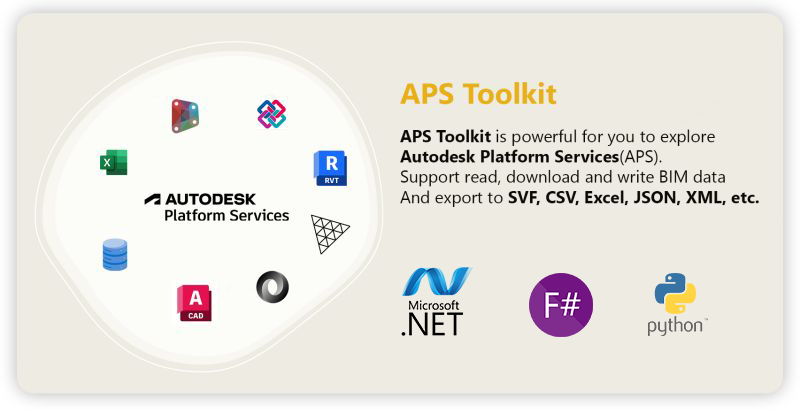

 [](https://opensource.org/licenses/MIT)

   

[](../../actions)
[](https://www.nuget.org/packages/APSToolkit)

[](https://www.nuget.org/packages/APSToolkit/)

<a href="https://twitter.com/intent/follow?screen_name=chuongmep">
</a>

## 🔩 APS Toolkit 

APS Toolkit (Former is Forge) is powerful for you to explore `Autodesk Platform Services`(APS). It's built on top of [Autodesk.Forge](https://www.nuget.org/packages/Autodesk.Forge/) and [Newtonsoft.Json](https://www.nuget.org/packages/Newtonsoft.Json/). Forge Toolkit includes some features allow you to read, download and write data from `Autodesk Platform Services` and export to CSV, Excel, JSON, XML, etc.



## ⚡ Features

- [x] Read/Download SVF Model
- [x] Read/Query Properties Database SQLite
- [x] Read/Download Properties Without Viewer
- [x] Read Geometry Data 
- [x] Read Metadata
- [x] Read Fragments
- [x] Read MeshPacks
- [x] Read Images
- [x] Export Data to CSV
- [x] Export Data to Excel
- [x] Export Data to Parquet

## ⚙ Installation

### .NET 

Please follow latest update at [APSToolkit Nuget](https://www.nuget.org/packages/APSToolkit)

```bash
<PackageReference Include="APSToolkit" Version="1.*" />
```

### Python 

Please follow latest update at [APSToolkit Python](https://pypi.org/project/aps-toolkit/)

```bash
pip install aps-toolkit --upgrade
```

Before start you need setup your environment:

```bash
APS_CLIENT_ID = <your client id>
APS_CLIENT_SECRET = <your client secret>
APS_REFRESH_TOKEN = <your refresh token>
```

## ⭐ Getting Started

I want export Revit Data To Excel 👇

### .NET

```csharp
using APSToolkit;
using Autodesk.Forge;
using APSToolkit.Database;
using APSToolkit.Auth;
var token = Authentication.Get2LeggedToken().Result;
string urn = "dXJuOmFkc2sud2lwcHJvZDpmcy5maWxlOnZmLk9kOHR4RGJLU1NlbFRvVmcxb2MxVkE_dmVyc2lvbj0z";
var RevitPropDbReader = new PropDbReaderRevit(urn, token);
RevitPropDbReader.ExportAllDataToExcel("result.xlsx");
```

### Python

```python
from aps_toolkit import Auth
from aps_toolkit import PropDbReaderRevit
auth = Auth()
token = auth.auth2leg()
urn = "dXJuOmFkc2sud2lwcHJvZDpmcy5maWxlOnZmLk9kOHR4RGJLU1NlbFRvVmcxb2MxVkE_dmVyc2lvbj0z"
prop_reader = PropDbReaderRevit(urn, token)
df = prop_reader.get_data_by_category("Ducts")
df.save_to_excel("result.xlsx")
```

## 📚 Tutorials

### .NET

All Tutorials are available under Jupyter Notebook at [.NET Tutorials](./docs/Tutorials)

- [00. Jupyter Notebook And .NET Interactive](./docs/Tutorials/00.%20Jupyter%20Notebook%20And%20.NET%20Interactive.ipynb)
- [01. Setup And Authentication](./docs/Tutorials/01.%20Setup%20And%20Authentication.ipynb)
- [02. Explore Hubs - Projects - Items - URN](./docs/Tutorials/02.%20Explore%20Hubs%20-%20Projects%20-%20Items%20-%20URN.ipynb)
- [03. Explore Versions Item and Derivative Urn](./docs/Tutorials/03.%20Explore%20Versions%20Item%20and%20Derivative%20Urn.ipynb)
- [04. Explore General Metdadata With APSToolkit](./docs/Tutorials/04.%20Explore%20General%20Metdadata%20With%20APSToolkit.ipynb)
- [04.01. Explore Revit Data With APSToolkit](./docs/Tutorials/04.01.%20Explore%20Revit%20Data%20With%20APSToolkit.ipynb)
- [05. Explore Access APS Database And Execute Query](./docs/Tutorials/05.%20Explore%20Access%20Database%20And%20Query%20Items.ipynb)
- [06. Explore SVF Format - Export SVF Viewer](./docs/Tutorials/06.%20Explore%20SVF%20-%20Export%20SVF%20Viewer.ipynb)
- [07. Explore Update Revit Data Back To ACC](./docs/Tutorials/07.%20Explore%20Update%20Revit%20Data%20Back%20To%20ACC.ipynb)
- [08. Explore Pull Data From ACC BIM360 API](./docs/Tutorials/08.%20Explore%20Pull%20Data%20From%20ACC%20BIM360%20API.ipynb)
- [09. Explore Data Knowledge Use LLM Agent](./docs/Tutorials/09.%20Explore%20Data%20Knowledge%20Use%20LLM%20Agent.ipynb)
- [10. Build Pipeline Data Process with APSToolkit](./docs/Tutorials/10.%20Build%20Pipeline%20Data%20Process%20with%20APSToolkit.ipynb)
- [11. Visualization Data - Data Analyst](./docs/Tutorials/11.%20Visualization%20Data%20-%20Data%20Analyst.ipynb)
- [12. Custom Python In .NET Interactive](./docs/Tutorials/12.%20Custom%20Python%20In%20.NET%20Interactive.ipynb)
- [13. Custom Metadata Export](./docs/Tutorials/13.%20Custom%20Metadata%20Export.ipynb) 


### Python

All Tutorials are available under Jupyter Notebook at [Python Tutorials](./APSToolkitPython/Tutorials)

- [00. Jupyter Notebook And Python](https://colab.research.google.com/github/chuongmep/aps-toolkit/blob/dev/APSToolkitPython/Tutorials/00.%20Jupyter%20Notebook%20And%20Python.ipynb)
- [01. Setup And Authentication](https://colab.research.google.com/github/chuongmep/aps-toolkit/blob/dev/APSToolkitPython/Tutorials/01.%20Setup%20And%20Authentication.ipynb)
- [02. Explore Hubs - Projects - Items - URN](https://colab.research.google.com/github/chuongmep/aps-toolkit/blob/dev/APSToolkitPython/Tutorials/02.%20Explore%20Hubs%20-%20Projects%20-%20Items%20-%20URN.ipynb)
- [03. Explore Versions Item and Derivative Urn](https://colab.research.google.com/github/chuongmep/aps-toolkit/blob/dev/APSToolkitPython/Tutorials/03.%20Explore%20Versions%20Item%20and%20Derivative%20Urn.ipynb)
- [04. Explore General Metdadata With APSToolkit](https://colab.research.google.com/github/chuongmep/aps-toolkit/blob/dev/APSToolkitPython/Tutorials/04.%20Explore%20General%20Metdadata%20With%20APSToolkit.ipynb)
  - [04.01. Explore Revit Data With APSToolkit](https://colab.research.google.com/github/chuongmep/aps-toolkit/blob/dev/APSToolkitPython/Tutorials/04.01.%20Explore%20Revit%20Data%20With%20APSToolkit.ipynb)
  - [04.02. Explore Compare Revit Data Versions](https://colab.research.google.com/github/chuongmep/aps-toolkit/blob/dev/APSToolkitPython/Tutorials/04.02.%20Explore%20Compare%20Revit%20Data%20Versions.ipynb)
- [05. Explore Access Database And Query Items](https://colab.research.google.com/github/chuongmep/aps-toolkit/blob/dev/APSToolkitPython/Tutorials/05.%20Explore%20Access%20Database%20And%20Query%20Items.ipynb)
- [06. Data Visualization - Analyst BIM Model](https://colab.research.google.com/github/chuongmep/aps-toolkit/blob/dev/APSToolkitPython/Tutorials/06.%20Data%20Visualization%20-%20Analyst%20BIM%20Model.ipynb)
- [07. Explore Big Data Format Storage](https://colab.research.google.com/github/chuongmep/aps-toolkit/blob/dev/APSToolkitPython/Tutorials/07.%20Explore%20Big%20Data%20Format%20Storage.ipynb)
- [08. Explore URL ACC Extract](https://colab.research.google.com/github/chuongmep/aps-toolkit/blob/dev/APSToolkitPython/Tutorials/08.%20Explore%20URL%20ACC%20Extract.ipynb)

## License

This project is licensed under the terms of the [gnu-gpl-v3.0](License.md). Some part of the project base on the licese follow the original project :

- [forge-convert-utils](https://github.com/petrbroz/forge-convert-utils)
- [UnityForgeImporter](https://github.com/chuongmep/UnityForgeImporter)
- [forge-bucketsmanager-desktop](https://github.com/Autodesk-Forge/forge-bucketsmanager-desktop)

## 👨‍🏫 Contributing

Please read [CONTRIBUTING.md](CONTRIBUTING.md) for details on our code of conduct, and the process for submitting pull requests to us.

## 🎁 Sponsors


Thanks [JetBrains](https://www.jetbrains.com/) for providing a free All product IDE for this project.

---

## Disclaimer

This is not an official Autodesk product to support for Autodesk Platform Services. Use it at your own risk. 

I'm not responsible for any data loss or any other issues caused by using this library, some features need require cost for using. Please read carefully the [Autodesk Forge](https://forge.autodesk.com/) and [Autodesk Platform Services](https://www.autodesk.com/platform-services) terms of use. I'm just doing, testing , maintaining in free time, so feel free to contribute and make it better. 